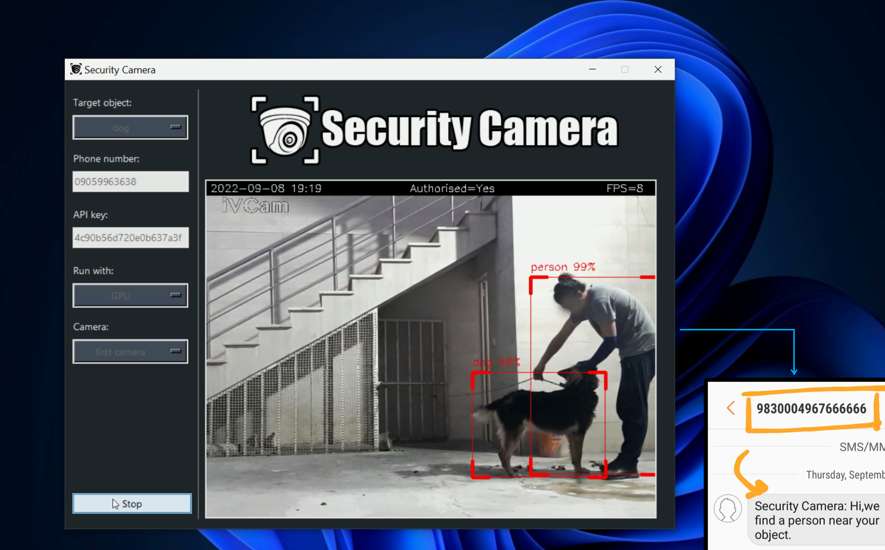

    

***

## Description

This app **protects** your object. that is, if someone **approaches** your object, it will recognize it and send you a **message**
(to your phone number) and it is activated by your own **QR Code**.

the **objects** it can protect, includes:
* bicycle
* boat
* car
* cat
* cow
* dog
* horse
* laptop
* motorbike
* sheep
* truck

we used [opencv](https://opencv.org/) library in this project and [YOLOv3](https://pjreddie.com/darknet/yolo/) to detect objects and [Tkinter](https://docs.python.org/3/library/tkinter.html) for GUI(graphical user interface).
 and this program can be run with **CPU** or **GPU**, we recommend you **GPU**(because it has high speed).

## How to use it
1. first download `yolov3_4.weights` from this [link](https://pjreddie.com/media/files/yolov3.weights), and put it in the following **folder**:
 `security-camera\files\yolov3_files`

2. watch this [video](https://www.youtube.com/watch?v=tjXkW0-4gME&list=WL&index=17) to enable **GPU**.

3. to send **sms** to your phone number, you need to open an account [here](https://www.melipayamak.com/) and watch this 
[video](https://www.aparat.com/v/1UVfA) to find your own **API**.

4. use this [website](https://qr.io/?gclid=Cj0KCQjwuaiXBhCCARIsAKZLt3nWe9ZCSwixmTXkZkTn3pbntnwGs5s3gf5OfloCvMjBH0SMorAfyvEaAgtsEALw_wcB) 
to create your own **QR Code** and select the *text* option.

5. if you want to use **video** instead of using camera, You should put the video in the following **folder**:
 `security-camera\files\videos`

6. finally, open **cmd**(Command Prompt) in the **security-camera folder** and execute the following command:
 `python main.py` 

## Screenshot

    

## Demo
https://user-images.githubusercontent.com/63948831/192821861-5997b80e-f858-4de4-af38-df254614ac26.mp4
